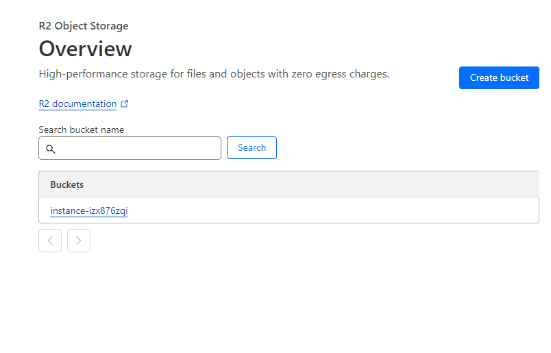
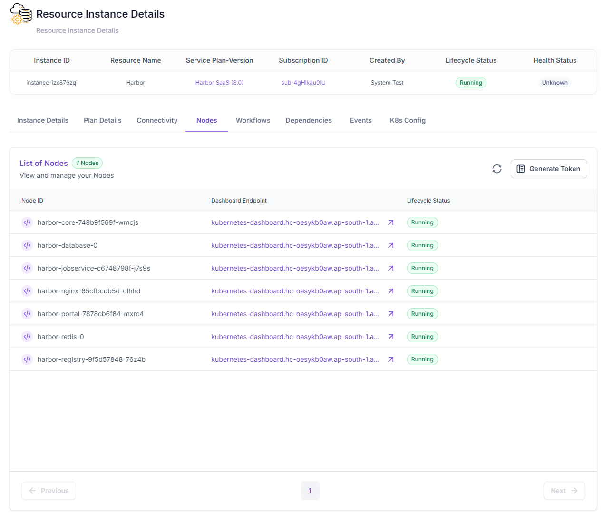

# Harbor SaaS using Cloudflare R2 (WIP)

This is a guide to set up a Harbor registry SaaS using Cloudflare R2 using Helm.

## Prerequisites

- An AWS account
- A Cloudflare account
- An Omnistrate account
- A custom domain (if you want to test with a custom domain)
- Omnistrate CLI

## Start

```bash
omnistrate-ctl build -f spec.yaml --name 'Harbor' --release-as-preferred --spec-type ServicePlanSpec
```

## Result

1. Automated deployment and management of R2 buckets


2. Automated deployment and management of Harbor Helm charts and cloud infrastructure
